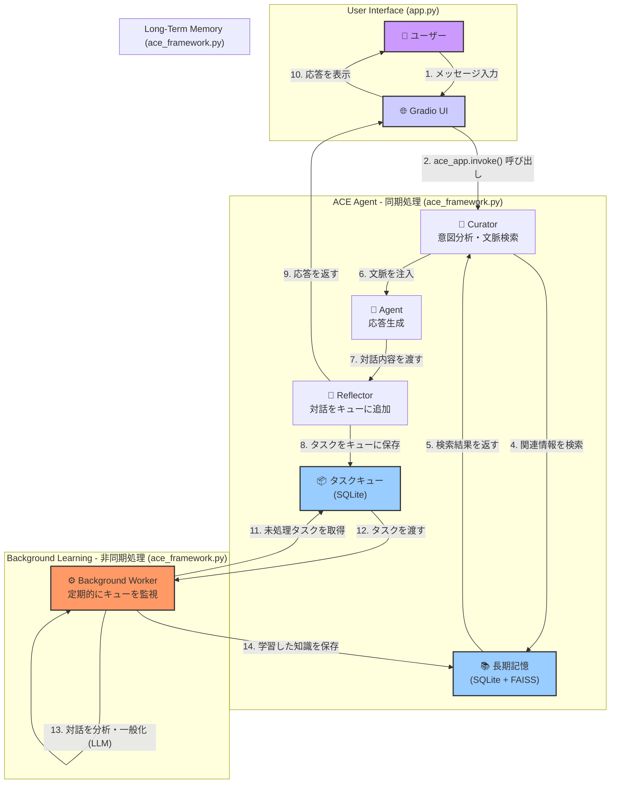

# Agentic Context Engineering Framework Lesson （学習メモ）:

※このレポジトリは勉強中の立場から自分なりに解釈・改変しつつまとめた学習ログです。
This repository documents my learner‑level exploration of the ACE Framework.
It includes personal interpretations, experimental notes, and incremental refinements made while studying the topic.

An LLM agent framework designed to demonstrate persistent memory, structural learning, and adaptive context engineering. ACE goes beyond simple chatbots by actively learning from interactions and retrieving generalized strategies to solve novel problems.

## 🧠 Core Architecture

The ACE Framework operates on a cognitive cycle composed of five key components:

1.  **Curator (Retrieval & Context)**
    *   **Function**: Analyzes user intent and queries the long-term memory.
    *   **Advanced Logic**: Extracts both specific entities (e.g., "5L jug") and abstract problem classes (e.g., "Constraint Satisfaction"). It injects relevant past experiences into the prompt context *before* the agent generates a response.

2.  **Agent (Reasoning & Action)**
    *   **Function**: The core LLM that generates responses or executes tools.
    *   **Context-Aware**: Utilizes the context provided by the Curator to ground its answers in established knowledge or past lessons.

3.  **Reflector (Queuing & Hand-off)**
    *   **Function**: Runs immediately after the agent's response.
    *   **Action**: Instead of blocking the user for analysis, it **queues** the interaction into a persistent task queue, ensuring instant feedback to the user.

4.  **Background Worker (Async Analysis)**
    *   **Function**: A dedicated thread that continuously processes the task queue.
    *   **Structural Learning (MFR)**: Performs the heavy lifting of deconstructing the conversation into a **Specific Model** and **Generalization**.
    *   **Benefits**: Achieves **High Responsiveness** (UI doesn't freeze) and **Zero Data Loss** (tasks are persisted in DB until successfully processed).

5.  **Long-Term Memory**
    *   **Hybrid Storage**: Combines **SQLite** for structured metadata/text and **FAISS** for vector embedding search.
    *   **Task Queue**: Uses a persistent SQLite table to manage background jobs, ensuring no insights are lost even across restarts.
    *   **Persistence**: Knowledge survives application restarts, allowing the agent to "grow" over time.

## ⚙️ 処理フローの可視化 (Visualization)

このシステムのアーキテクチャは、**同期的な対話ループ**と**非同期的な学習ループ**という2つの主要なサイクルで構成されています。これにより、ユーザーへの即時応答性と、バックグラウンドでの継続的な自己改善を両立させています。



### Part 1: 同期的な対話ループ (ユーザーへの即時応答)

このループは、ユーザーがメッセージを送信してからエージェントが応答を返すまでの、リアルタイムで行われる処理です。

-   **ユーザー入力**
    -   ユーザーがGradioのUIにメッセージを入力し、「送信」ボタンを押します。
    -   **関連コード**: `app.py` - `gr.Textbox` / `gr.Button`

-   **エージェント呼び出し**
    -   Gradioのイベントが`app.py`の`process_chat`関数をトリガーします。この関数は、対話履歴をLangChainのメッセージ形式に変換し、`ace_app.invoke()`を呼び出してACE Agentのワークフローを開始します。
    -   **関連コード**: `app.py` - `process_chat`関数

-   **Curator: 意図分析と文脈検索**
    -   ワークフローの最初のノードである`curator_node`が実行されます。LLMを呼び出してユーザーの最新のメッセージから「具体的なエンティティ」と「抽象的な問題クラス」を抽出し、それに基づいて長期記憶を検索するためのクエリを生成します。
    -   **関連コード**: `ace_framework.py` - `curator_node`関数

-   **長期記憶からの検索**
    -   `curator_node`は`ACE_Memory`クラスの`search`メソッドを呼び出します。このメソッドは、FAISSによるベクトル検索とSQLite FTS5によるキーワード検索を組み合わせたハイブリッド検索を実行し、関連する過去の知識（ドキュメント）を取得します。
    -   **関連コード**: `ace_framework.py` - `ACE_Memory.search`メソッド

-   **Agent: 応答生成**
    -   Curatorによって検索された知識は、システムメッセージとして対話履歴の先頭に注入（コンテキストとして追加）されます。この強化されたコンテキストを受け取った`agent_node`が、LLMを呼び出してユーザーへの最終的な応答を生成します。
    -   **関連コード**: `ace_framework.py` - `agent_node`関数

-   **Reflector: 対話の記録**
    -   Agentの応答後、`reflector_node`が実行されます。このノードの役割は、今回の対話（ユーザー入力とAgent応答のペア）を分析・学習させるために、`ACE_Memory`の`enqueue_task`メソッドを呼び出してタスクキュー（SQLiteテーブル）に保存することです。この処理は非常に軽量で、ユーザーを待たせることはありません。
    -   **関連コード**: `ace_framework.py` - `reflector_node`関数, `ACE_Memory.enqueue_task`メソッド

-   **ユーザーへの応答**
    -   `reflector_node`の処理が終わると、同期処理である`ace_app.invoke()`が完了します。`app.py`の`process_chat`関数は最終的な応答テキストをGradioのチャットボットに返し、ユーザーの画面に応答が表示されます。
    -   **関連コード**: `app.py` - `process_chat`関数

### Part 2: 非同期的な学習ループ (バックグラウンドでの自己改善)

このループは、メインの対話スレッドとは独立してバックグラウンドで実行され、エージェントが過去の対話から学習し、長期記憶を豊かにしていくプロセスを担います。

-   **タスクの取得**
    -   `app.py`の起動と同時に開始された`BackgroundWorker`スレッドが、定期的にタスクキューをチェックします。`ACE_Memory.fetch_pending_task`メソッドを使い、ステータスが'pending'の最も古いタスクを1件取得します。
    -   **関連コード**: `ace_framework.py` - `BackgroundWorker.run`, `ACE_Memory.fetch_pending_task`

-   **分析と一般化**
    -   取得したタスク（対話ペア）を`BackgroundWorker.process_task`メソッドで処理します。ここでは、「具体的なモデルの分析」と「抽象的なパターンの一般化」を行うように設計されたプロンプトを使ってLLMを再度呼び出します。このステップで、対話から再利用可能な知識（教訓や戦略）が抽出されます。
    -   **関連コード**: `ace_framework.py` - `BackgroundWorker.process_task`

-   **長期記憶への保存**
    -   LLMによる分析結果に、保存すべき価値がある（`should_store: true`）と判断された場合、抽出された知識が`ACE_Memory.add`メソッドを通じて長期記憶に保存されます。具体的には、テキストデータはSQLiteに、そのベクトル表現はFAISSインデックスに追加されます。これにより、未来の対話でCuratorがこの新しい知識を検索・利用できるようになります。
    -   **関連コード**: `ace_framework.py` - `ACE_Memory.add`メソッド

## 🚀 Setup & Installation

This project uses `uv` for fast and reliable dependency management.

### Prerequisites
*   Python 3.10+
*   `uv` installed (`curl -LsSf https://astral.sh/uv/install.sh | sh`)

### Installation

```bash
# 1. Clone the repository
git clone <repository_url>
cd ace_rm

# 2. Install dependencies
uv sync
```

### Environment Configuration

Create a `.env` file in the root directory:

```env
# Required: Compatible OpenAI API Key (e.g., Sakura, OpenAI, Azure)
SAKURA_API_KEY=your_api_key_here

# Optional: Long-Term Memory (LTM) Mode
# Controls how the agent's memory is managed in a multi-user environment.
# - "isolated" (Default): Each user session gets a private, independent memory. This is recommended for most use cases to ensure data privacy.
# - "shared": All users interact with a single, global memory. The agent learns collectively from all interactions.
LTM_MODE=isolated
```

## 🖥️ Usage

### Interactive Web UI (Gradio)

The main entry point is a 3-pane Gradio interface that visualizes the agent's internal thought process.

```bash
uv run python src/ace_rm/app.py
```

*   **Left Pane**: Chat interface.
*   **Center Pane**: Debug view showing **Curator** retrieval and **Reflector** analysis in real-time.
*   **Right Pane**: Live view of the Long-Term Memory database.

### Command Line Interface

You can also interact with the core logic via provided test scripts.

## 🧪 Testing & Verification

### Manual Memory Flow Test

We provide a specialized script to verify the agent's cognitive loop (Learn -> Retrieve -> Transfer). This script simulates a "Water Jug Puzzle" scenario to demonstrate structural learning.

```bash
uv run python tests/manual_test_memory_flow.py
```

**What this script does:**

1.  **Step 1 (Learning)**:
    *   Sends a query: *"How to measure 4L using 3L and 5L jugs?"*
    *   **Expectation**: The Agent solves it. The **Reflector** analyzes the solution, abstracts it into a "Water Jug / Diophantine Reachability" strategy, and stores it in memory.

2.  **Step 2 (Transfer)**:
    *   Sends a follow-up query: *"Can you apply the same strategy to 5L and 8L jugs to measure 2L?"*
    *   **Expectation**: The **Curator** retrieves the generalized strategy learned in Step 1. The Agent applies this strategy to the new variables (5L & 8L) to solve the new problem without starting from scratch.

**Output Interpretation:**
*   Look for `[Reflector] Should Store: True` in Step 1.
*   Look for `[Curator] Found knowledge about: ...` in Step 2.

### Unit Tests

Run the standard test suite to verify individual components.

```bash
uv run pytest
```

## 📂 Project Structure

```text
ace_rm/
├── src/ace_rm/
│   ├── ace_framework.py  # Core logic (Graph definition, Nodes, Memory)
│   └── app.py            # Gradio UI application
├── tests/
│   ├── manual_test_memory_flow.py # End-to-end cognitive flow verification
│   └── ...
├── docs/                 # Architecture and planning documents
├── ace_memory.db         # SQLite database (auto-generated)
├── ace_memory.faiss      # Vector index (auto-generated)
└── pyproject.toml        # Project configuration
```

## References
- Agentic Context Engineering: Evolving Contexts for Self-Improving Language Models. arXiv: [2510.04618](https://arxiv.org/abs/2510.04618)
- Model-First Reasoning LLM Agents: Reducing Hallucinations through Explicit Problem Modeling. arXiv: [2512.14474](https://arxiv.org/abs/2512.14474)
