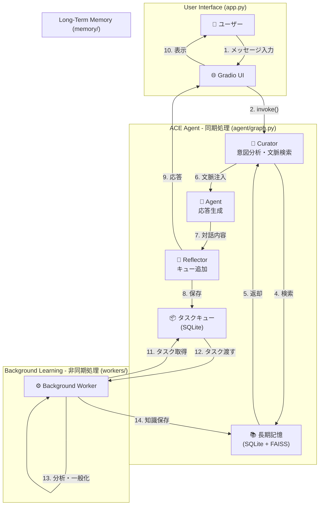

# 🏗️ 3. アーキテクチャ

ACE Frameworkのアーキテクチャは、**同期的な対話ループ**と**非同期的な学習ループ**という2つの主要なサイクルで構成されています。

## システム構成図

## 1. 同期的な対話ループ (即時応答)
ユーザーのメッセージに対し、リアルタイムで知識を検索し、最適な応答を生成するループです。

1. **Curator**: ユーザーの意図を分析し、長期記憶から関連ドキュメントを抽出。
2. **Agent**: 抽出された知識をコンテキストとして受け取り、LLMで応答を生成。
3. **Reflector**: 対話内容を非同期学習用のタスクキューに登録。

## 2. 非同期的な学習ループ (自己改善)
メインスレッドとは独立して動き、エージェントが過去の対話から継続的に学習するプロセスです。

1. **Task Fetch**: `BackgroundWorker` が未処理のタスクをキューから取得。
2. **Analysis**: 対話を分析し、具体的な解決策と抽象的な一般化（MFR）を抽出。
3. **Synthesis**: 既存の知識を更新すべきか、新規追加すべきかを判断。
4. **Persistence**: 処理された知識を長期記憶（SQLite + FAISS）に反映。

## 技術スタック
- **LLM オーケストレーション**: LangGraph, LangChain
- **ベクトル検索**: FAISS
- **メタデータ管理**: SQLite (FTS5)
- **埋め込みモデル**: sentence-transformers (cl-nagoya/ruri-v3-30m)
- **UI フレームワーク**: Gradio

---
詳細は [コアコンポーネント](./06-コアコンポーネント.md) を参照してください。
